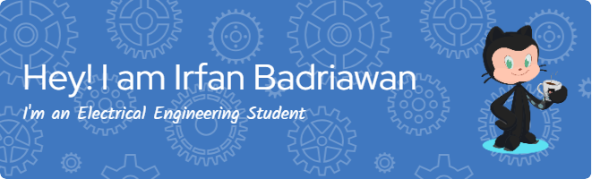

<h1 align="center">Hi 👋, I'm Irfan Badriawan</h1>
<h3 align="center">I'm a person who will keep learning</h3>

  

- 🔭 I’m currently working on **Smart Parking System**

- 🌱 I’m currently learning **Computer Vision and Machine Learning**

- 👨‍💻 All of my projects are available at [https://irfanzid.github.io/](https://irfanzid.github.io/)

- 📫 How to reach me **muhammad.irfan080501@gmail.com**

<h3 align="left">Connect with me:</h3>

<h3 align="left">Languages and Tools:</h3>

               

